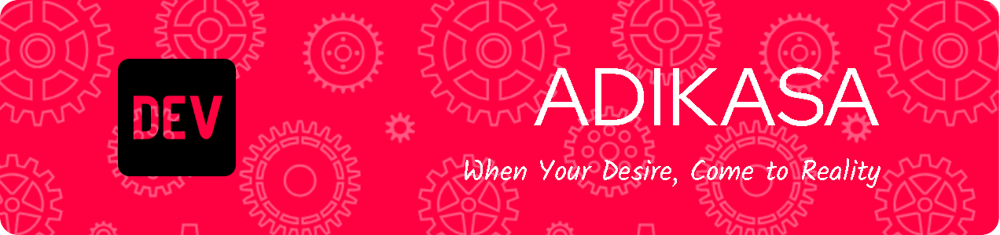

## Tentang ADIKASA 👋
**Adidaya Kreasi Digital** x ✨ _bergerak_ ✨ pada bidang Konsultan IT, Pendidikan & Pelatihan, Penerbitan Buku, Percetakan umum dan Desain Grafis, Website, Software, Game dan Aplikasi lainnya. Seiring dengan pesatnya perkembangan teknologi dan keterkaitan nya dengan bidang usaha, [Adiadayadigital.com](https://adidayadigital.com/) hadir di dunia Teknologi Informasi untuk memberikan Solusi, Perencanaan, dan Strategi yang terintegerasi, sebagai nilai tambah yang maksimal bagi kebutuhan dan permasalahan dibidang Teknologi Informasi.
<!--
**Adikasa/adikasa** is a ✨ _special_ ✨ repository because its `README.md` (this file) appears on your GitHub profile.

Here are some ideas to get you started:

- 🔭 I’m currently working on ...
- 🌱 I’m currently learning ...
- 👯 I’m looking to collaborate on ...
- 🤔 I’m looking for help with ...
- 💬 Ask me about ...
- 📫 How to reach me: ...
- 😄 Pronouns: ...
- ⚡ Fun fact: ...
-->
- 🔭 Projek yang sedang berjalan: **@ultracomdeprasti**, **@smkn1gunungsindur**, **@depokhostinger**.
- 📫 Hubungi Kami [Adiadayadigital.com](https://adidayadigital.com/), **+62 812 101 101 60**, **info@adidayadigital.com**,
- Medsos: [Instagram](https://www.instagram.com/adidayakreasidigital/), [Facebook](https://www.facebook.com/people/Adi-Daya/100088190787506/), [Twitter](https://x.com/Adidayadigital), 
